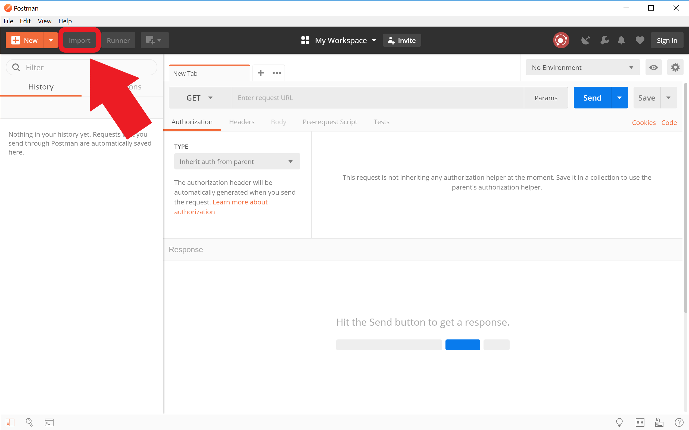
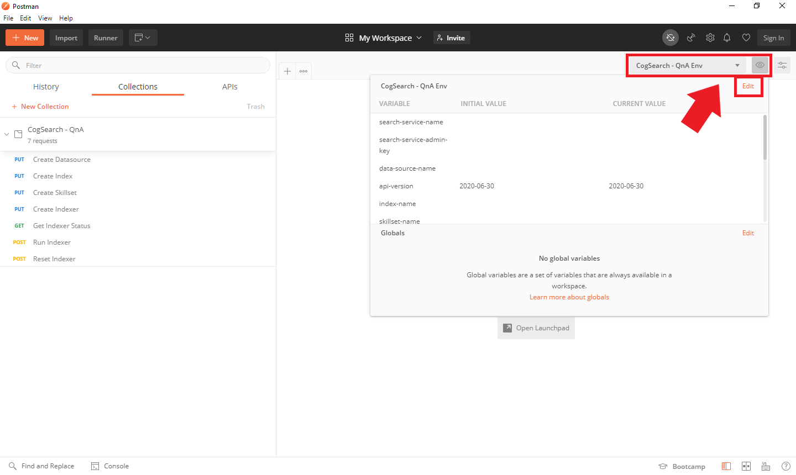

# Creating a search index with Postman

This folder contains a Postman collection and environment that can be used to create a search index programmatically.  Using Postman allows you to parameterize the API calls, edit the API calls to customize your pipeline, and to easily share & preserve your changes.  

This collection is pre-configured to take advantage of a majority of the out of the box Cognitive Search functionality.

We recommend using this collection to create an initial index and then iterating by editing the postman collection and adding custom skills as needed. This collection assumes that Azure Blob storage is the primary data source. Please see this [documentation](https://docs.microsoft.com/en-us/rest/api/searchservice/create-data-source) to understand the necessary changes if you wish to use a different data source.

## Prerequisites

1. [Postman](https://www.postman.com/downloads/) installed for your operating system
2. Documents uploaded to your Azure Blob storage container

## Setup instructions

### 1. Import files
Import `CogSearch - QnA.postman_collection.json` and `CogSearch - QnA Env.postman_environment.json` using the Postman UI. 

### 2. Update environment variables

Set the environment using the dropdown highlighted below and then update the environment variables by selecting the *eye button* and then selecting edit. These variables are used to parameterize the API calls and save you from having to edit variables for each call. 

The Postman collection requires the following parameters:

+ **search-service-name** - the name of your Azure Cognitive Search Service; this can be found in the deployment outputs 
+ **data-source-name** - the name of your search data source; this can be whatever you want
+ **index-name** - the name of your search index; this can be whatever you want
+ **skillset-name** - the name of your search index; this can be whatever you want
+ **indexer-name** - the name of your search indexer; this can be whatever you want
+ **api-version** - the API version for Azure Cognitive Search
+ **storage-connection-string** - the connection string for your blob storage account; this can be found in the deployment outputs 
+ **storage-container-name** - the name of the blob storage container you uploaded you documents into 
+ **cog-svc-allinone-key** - the key for your Cognitive services; this can be found in the deployment outputs 
+ **function-name** - the name of the Azure Function project; this can be found in the deployment outputs 
+ **function-code** - the code to access the Azure Function; this can be found in the deployment outputs 

### 3. Run API calls
To create a cognitive search index, run the following API calls in order:

1. Create Datasource
1. Create Index
1. Create Skillset
1. Create Indexer

You can then run *Get indexer status* to see if documents are processing or if there are any errors. If the indexer does not start running automatically, you can run the indexer manually.

### 4. Monitor results

You should now be able to query the index for search results. 

To monitor for QnA upload completion, check the storage account for a queue called "upload-to-qna".  Once that queue has no values remaining, the QnA upload process will be complete. If any queue messages end up in a queue called "upload-to-qna-poison", then there is likely something wrong with the queue execution that needs to be investigated. You can also verify that the status got updated in the index correctly by running the query "$select=status".

If you need to debug the custom skill or queue trigger, we recommend that you attach an Application Insights service to the function instance and then monitor the function while it is executing by using the [Log streaming option](https://docs.microsoft.com/azure/azure-functions/functions-monitoring?tabs=cmd#built-in-log-streaming) in the portal.

## Additional resources

For more help working with Postman, see the [documentation](https://www.getpostman.com/docs/v6/postman/launching_postman/sending_the_first_request) on the Postman website.
