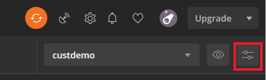
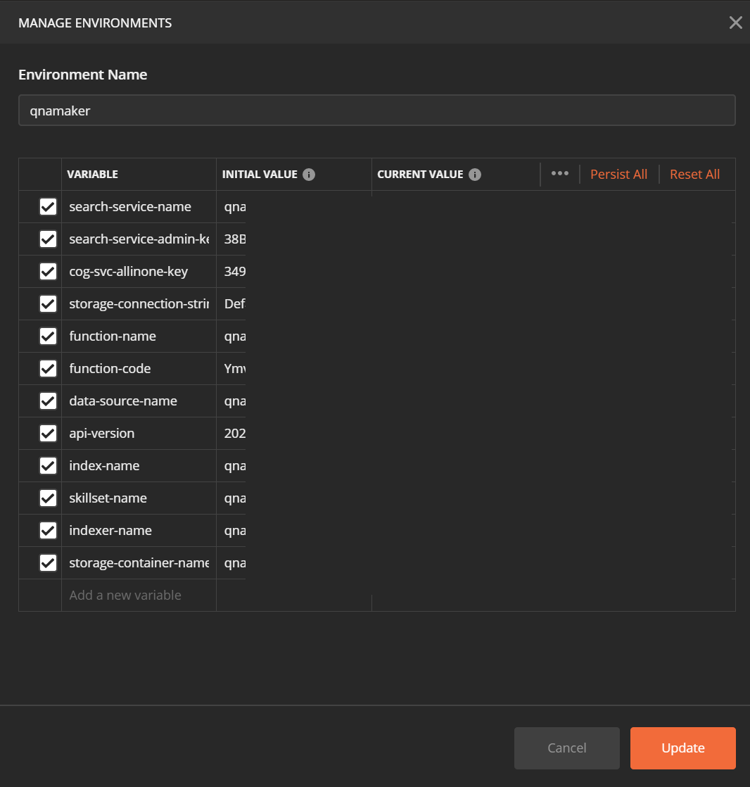

# Cognitive Search Question Answering Solution Accelerator
An integrated search solution leveraging [Azure Cognitive Search](https://azure.microsoft.com/services/search/) and [QnA Maker](https://www.qnamaker.ai/)

This solution accelerator leverages the power of Azure Cognitive Search together with QnA Maker to find answers to your questions.  Ordinarily, Azure Cognitive Search returns the most relevant documents for your search query.  Together with QnA Maker integration, it can not only find the most relevant documents but also pull the question's answer out of the document.  

Please note that not all documents support the [question/answer format required by QnA Maker](https://docs.microsoft.com/azure/cognitive-services/qnamaker/concepts/data-sources-and-content#file-and-url-data-types).  

This solution accelerator contains the following artifacts:
+ ARM template to set up the solution
+ Custom skill in Cognitive Search, which ingests the data into QnA Maker
+ User interface to view the results

## Deploy

All the services and components needed for the solution are packaged in the ARM template. Click the `Deploy to Azure` button to get started. The following resources will be deployed:

1. Azure Cognitive Search
2. QnA Maker Cognitive Service
3. Azure App Service, App Service Plan
4. Azure App Service, Website
5. Storage Account
6. Azure Function App
7. Cognitive Services All in One resource

## Configure solution

1. Deploy the ARM template by clicking the button below. Copy the following properties from the outputs tab once the deployment completes.
 
    + Search Service Name
    + Search service API Key
    + Storage Account Connection String
    + Cognitive Services AllInOne Key
    + Function App Name
    + Function Host Code

1. Create a new blob container in the deployed storage account, and copy your data files into it. If you need a sample dataset see [data](#data). The container name will be used as the storage-container-name in the next step.
1. Download [the Postman collection](./QnA.postman_collection.json) and import it into Postman.

    The Postman collection requires the following parameters:
    + search-service-name
    + search-service-admin-key
    + data-source-name
    + api-version
    + index-name
    + skillset-name
    + indexer-name
    + storage-connection-string
    + storage-container-name
    + cog-svc-allinone-key
    + function-name
    + function-code

To add the parameters, click on the `Manage Environments` button under to ribbon on the top right of the Postman window.

Set the following environment variables coped from the outputs of the deployment.

+ search-service-name
+ search-service-admin-key
+ storage-connection-string
+ cog-svc-allinone-key
+ function-name
+ function-code

Set the following to a meaningful name:

+ data-source-name
+ index-name
+ skillset-name
+ indexer-name
+ api-version : 2020-06-30-Preview
+ storage-container-name : Your container name from step 2.

Once complete your save your environment. Your environment should look like this.

1. Create a knowledge base in your newly deployed QnAMaker instance at [https://www.qnamaker.ai/](https://www.qnamaker.ai/). Don't add any data to it or publish it yet.
    1. Grab the id for the knowledge base from the url, it will look something like this "https://www.qnamaker.ai/Edit/KnowledgeBase? kbId=**KnowledgeBaseID**&tenantId=**TenantId**" where you want the **KnowledgeBaseID**.
    1. [Update the application settings](https://docs.microsoft.com/en-us/azure/azure-functions/functions-how-to-use-azure-function-app-settings#portal) for the deployed function instance, set "KnowledgeBaseID" to the value of the knowledge id you just grabbed.
    1. Make sure to save (say yes to it being ok to restart the function).
1. Run the Postman commands in order:
    1. Create Datasource
    1. Create Index
    1. Create Skillset
    1. Create Indexer
1. Monitor the indexer status using the Postman command "Get Indexer Status" until it shows as complete. 
1. You should now be able to query the 'qna-idx' for search results. To monitor for QnA upload completion, check the storage account for a queue called "upload-to-qna".  Once that queue has no values remaining, the QnA upload process will be complete. If any queue messages end up in a queue called "upload-to-qna-poison", then there is likely something wrong with the queue execution that needs to be investigated. You can also verify that the status got updated in the index correctly by running the query "$select=status".
    1. I recommend that if you need to debug the custom skill or queue trigger, to attach an Application Insights service to the function instance and then monitor the function while it is executing by using the [Log streaming option](https://docs.microsoft.com/azure/azure-functions/functions-monitoring?tabs=cmd#built-in-log-streaming) in the portal.

## Data
The data I was using to test with [can be found here](https://github.com/JerryWei03/COVID-Q/tree/master/data/PDFs) if you want to reuse it.  Some of these files consistently fail upload to QnAMaker for reasons unknown to me. Make sure if we end up using this for the final demo that [we reference the author](https://github.com/JerryWei03/COVID-Q#citation) and verify the licensing as appropriate.

## TODO

1. Build/integrate frontend
1. Add website deployment to the ARM template once the frontend is built. [See here for example.](https://github.com/Azure/azure-quickstart-templates/tree/master/201-web-app-github-deploy)
1. [Have the function app use the included hosting plan](https://docs.microsoft.com/azure/azure-functions/functions-scale#app-service-plan) instead of needing to deploy a second one.
    1. I am unsure based on the parameters that QnA uses for the hosting plan for their required web app if we can also tack on the function, so that will need to be investigated/tested. 
    1. You will likely also want to use the same hosting plan for the frontend website to be included with the sample so ideally it would host all 3 resources when it is all said and done.
    1. If we do this, then we can in theory support an unlimited timeout for the queue trigger.  That would need to be tweaked in the host.json file.
    1. Also make sure the function is set to AlwaysOn so that the custom skill works correctly, per the linked documentation.
1. Add cognitive services enrichment skills to skillset/indexer output field mappings/index.
1. Fix [potential race condition](./UploadToQnAMaker.cs#L105) in index status update code.
1. Make the knowledge base id task a bit simpler.
    1. My idea for this is that instead of requiring it be set on the function app settings, pass it as a header to the custom skill. That way the customer just needs to paste it into the Postman collection (or otherwise the frontend once that exists) and it can be passed along to the custom skill/queue trigger execution that way.
1. Better documentation

## Resources
+ [Cognitive Search Documentation](https://docs.microsoft.com/azure/search/)
+ [QnA Maker Documentation](https://docs.microsoft.com/azure/cognitive-services/QnAMaker/)
