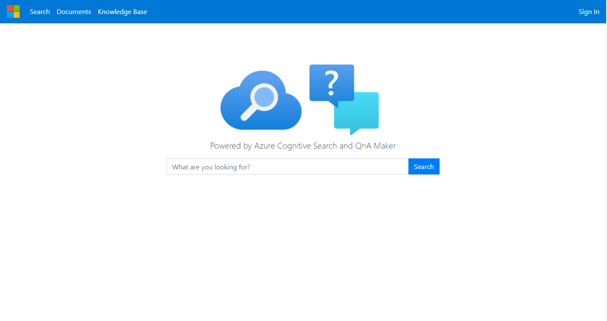
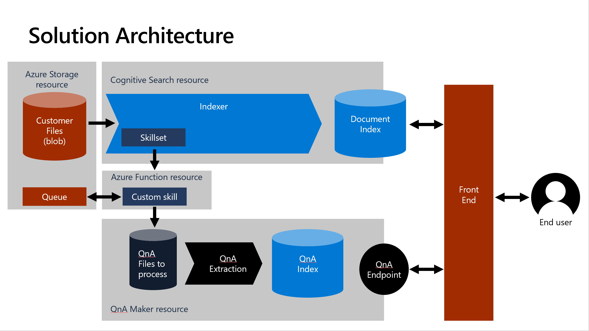
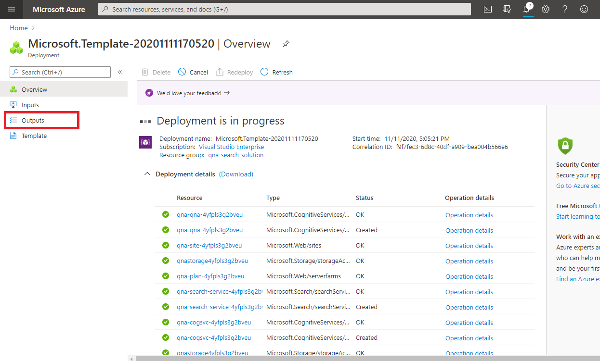
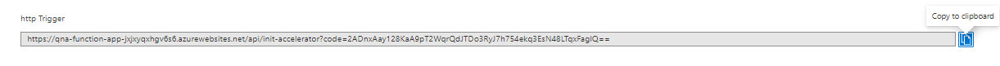
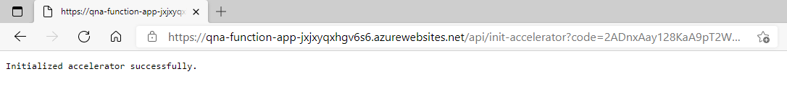
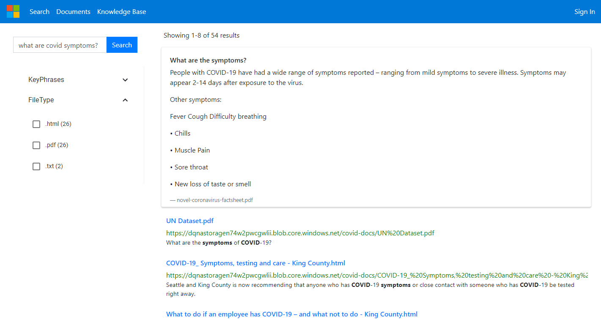

# Cognitive Search Question Answering Solution Accelerator
An integrated search solution leveraging [Azure Cognitive Search](https://azure.microsoft.com/services/search/) and [QnA Maker](https://www.qnamaker.ai/) to provide instant answers to common questions.

This solution accelerator leverages the power of Azure Cognitive Search together with QnA Maker to find answers to your questions in a similar way to how Bing and Google suggest relevant answers to queries.  

Ordinarily, Azure Cognitive Search returns the most relevant documents for your search query but together with QnA Maker integration, it can not only find the most relevant documents but also pull questions and answers out of the document and suggest the most relevant answers.  

Please note that not all documents support the [question/answer format required by QnA Maker](https://docs.microsoft.com/azure/cognitive-services/qnamaker/concepts/data-sources-and-content#file-and-url-data-types).  By default, the logic in the Search service indexer also ingests only the following file types: `.pdf,.docx,.doc,.xlsx,.xls,.html,.rtf,.txt,.tsv`.  You can change this by modifying the `indexedFileNameExtensions` property in the [Indexer.json](./CustomSkillForDataIngestion/QnAIntegrationCustomSkill/Assets/Indexer.json).  

This solution accelerator contains the following artifacts:
+ ARM template to set up the solution
+ Custom skill in Cognitive Search, which ingests the data into QnA Maker
+ User interface to view the results

## Live demo

You can view a live demo of this repo at the following link:

[https://qna-ui-72xfkwenjkcd2.azurewebsites.net/](https://qna-ui-72xfkwenjkcd2.azurewebsites.net/)

## Prerequisites

+ A GitHub account
+ [Node.js and Git](https://nodejs.org/)
+ [Visual Studio Code](https://code.visualstudio.com) installed
+ [Postman](https://www.getpostman.com/) for making API calls

## Getting started

### 1. Deploy Resources

The services and components needed for the solution are packaged in the repo's [ARM template](./azuredeploy.json). Click the **Deploy to Azure** button to get started:

The following resources will be deployed:

1. Azure Cognitive Search
2. QnA Maker Cognitive Service (this will always be deployed to the West US region, but your data is not stored here - see [here](https://docs.microsoft.com/en-us/azure/cognitive-services/qnamaker/concepts/azure-resources?tabs=v1#management-service-region))
3. Azure App Service, App Service Plan
4. Azure App Service, Website for Qna Maker
5. Azure App Service, Website to host the UI
6. Storage Account
7. Azure Function App
8. Cognitive Services All-in-one resource

The deployment may take several minutes. Once the deployment finishes, navigate over to the **Outputs** tab:

Copy the value of the HTTP Trigger. You'll use this value in the next step.

### 2. Initialize the solution

Open up a new browser tab and paste the URL into the browser. This will run for about a minute and then you'll see a message indicating success or failure.

### 3. Upload documents

Navigate to the storage account in the resource group you just created. Find the container named `qna-container` and upload your documents into the container. 

___
> NOTE: if you would prefer to pull data from a different, pre-existing blob storage account, you may instead change the data source in your Search service to point to a container in a different blob storage account.  Just change the connection string and container name in the data source in the Search service.  
___

### 4. Go to the UI

As part of the ARM template, a UI is deployed to `https://{prefix}-ui-{randomString}.azurewebsites.net` similar to the screenshot below. Keep in mind it will take a few minutes for the documents to become available in the search index after adding them to storage. 

At this point, you should consider [adding authentication to the web app in the Azure portal](https://docs.microsoft.com/en-us/azure/app-service/scenario-secure-app-authentication-app-service) to secure your data.

The UI is a React based Web App available in the `SearchUI` folder. Navigate to [**SearchUI/README.md**](search-ui/README.md) for more details on the web app. 

## Resources
+ [Cognitive Search Documentation](https://docs.microsoft.com/azure/search/)
+ [QnA Maker Documentation](https://docs.microsoft.com/azure/cognitive-services/QnAMaker/)
