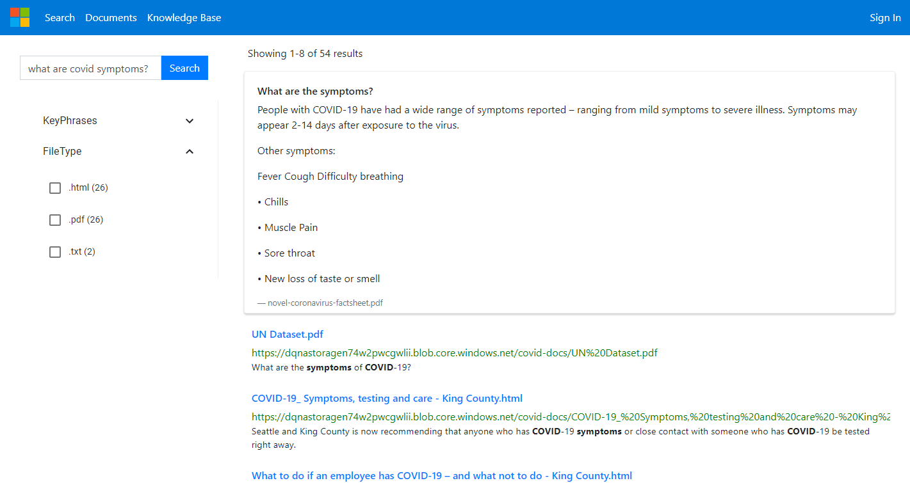

# Azure Cognitive Search UI

This sample is a React template for [Azure Cognitive Search](https://docs.microsoft.com/en-us/azure/search/search-what-is-azure-search). It leverages Azure Functions as the backend to communicate with Azure Cognitive Search and QnA Maker.



## Running the application locally

To run the sample locally, follow the steps below.

### Prerequisites

- [Node.js and Git](https://nodejs.org/)
- [Visual Studio](https://visualstudio.microsoft.com/) and [Function tools](https://docs.microsoft.com/en-us/azure/azure-functions/functions-develop-vs) for Visual Studio
- [Visual Studio Code](https://code.visualstudio.com/?WT.mc_id=shopathome-github-jopapa)

### Setup

1. Clone (or Fork and Clone) this repository

1. Open the Azure Function project `CustomSkillForDataIngestion\CustomSkillForDataIngestion.sln` in Visual Studio

1. Add a `local.settings.json` file to the project

The `local.settings.json` file holds all of the keys that the application needs and should include the following json:

```json
{
  "IsEncrypted": false,
  "Values": {
    "FUNCTIONS_WORKER_RUNTIME": "dotnet",

    "AzureWebJobsStorage": "DefaultEndpointsProtocol=https;AccountName={StorageAcountName};AccountKey={StorageAccountKey};",
    "StorageAccountName": "",
    "StorageAccountKey": "",
    
    "SearchServiceApiKey": "",
    "SearchServiceName": "",

    "QnAMakerEndpoint": "",

  },
  "Host": {
    "CORS": "*"
  }
}
```

### Run the Azure functions 

1. Run the Azure functon project in visual studio

### Running the front-end

1. Install front-end dependencies...

   ```bash
   npm install
   ```

1. Run the front-end project in the browser (automatically opens a browser window).

   ```bash
   npm start
   ```

The react project will pull the URL for the Azure functions from the `.env` file. If you'd like to run the front-end locally with the deployed Azure Functions, update the credentials in the `.env` file.