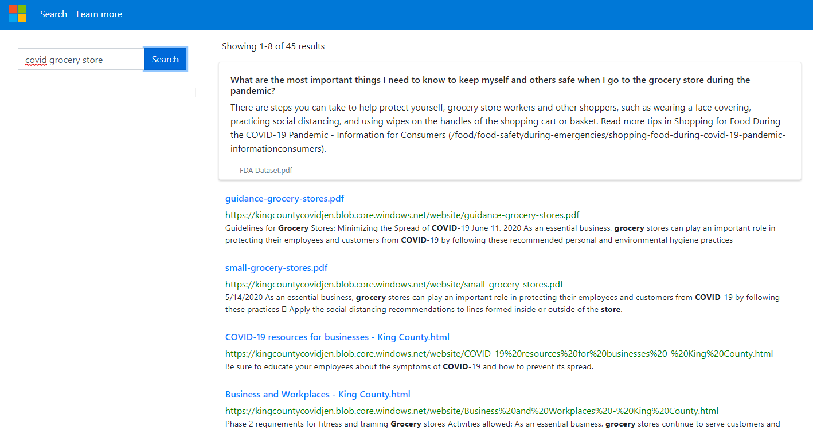
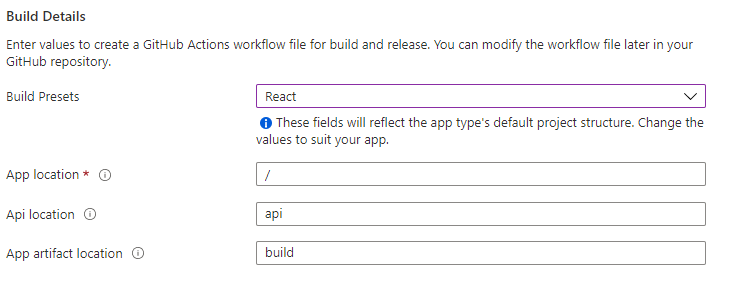
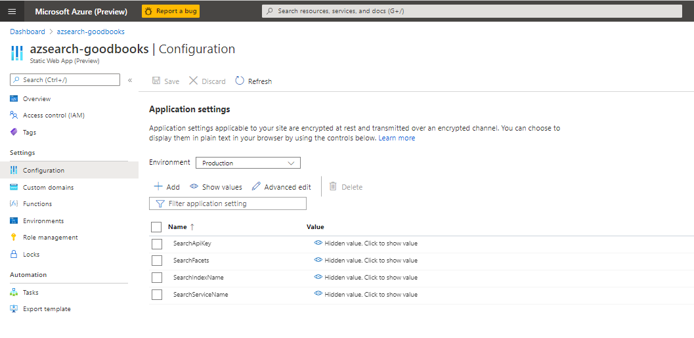

# Azure Cognitive Search UI

This sample is a React template for [Azure Cognitive Search](https://docs.microsoft.com/en-us/azure/search/search-what-is-azure-search). It leverages the [Azure SDK for Javascript/Typescript](https://github.com/Azure/azure-sdk-for-js/tree/master/sdk/search/search-documents/) and [Azure Static Web Apps](https://aka.ms/swadocs) to make it easy to get up and running with a simple web application.



You can easily deploy the sample onto Azure or run it locally by following the steps below.

## Running the application locally

To run the sample locally, follow the steps below.

### Prerequisites

- A GitHub account
- [Node.js and Git](https://nodejs.org/)
- [Visual Studio Code](https://code.visualstudio.com/?WT.mc_id=shopathome-github-jopapa) installed
- The [Azure Functions extension](https://marketplace.visualstudio.com/items?itemName=ms-azuretools.vscode-azurefunctions?WT.mc_id=shopathome-github-jopapa) installed
- The [Azure Functions Core Tools](https://docs.microsoft.com/azure/azure-functions/functions-run-local?WT.mc_id=shopathome-github-jopapa) installed

### Setup

1. Clone (or Fork and Clone) this repository

1. Rename the `api/local.settings.json.rename` file to `api/local.settings.json`.

The `local.settings.json` file holds all of the keys that the application needs and should include the following json:

```json
{
  "IsEncrypted": false,
  "Values": {
    "AzureWebJobsStorage": "",
    "FUNCTIONS_WORKER_RUNTIME": "node",
    "SearchApiKey": "",
    "SearchServiceName": "",
    "SearchIndexName": "",
    "SearchFacets": "",

    "QnAMakerEndpoint": "",
    "QnAMakerKey": "",
    "QnAMakerKnowledgeBaseId": ""
  }
}
```

## Run the app locally

This project can be run anywhere, but VS Code is required for local debugging.

1. Open the application with VS Code.

### Running the front-end

1. Install front-end dependencies...

   ```bash
   npm install
   ```

1. Run the front-end project in the browser (automatically opens a browser window).

   ```bash
   npm start
   ```

### Running the API

1. From VS Code, press <kbd>F5</kbd>

## Deploying this sample

### Prerequisites

- A GitHub account
- An Azure subscription

### Forking the repo

To start off, fork the repo so that you have your own copy.

### Creating the web app

Next, you need to create a Static Web App in the Azure portal. Click the button below to create one:

[](https://portal.azure.com/?feature.customportal=false#create/Microsoft.StaticApp)

This will walk you through the process of creating the web app and connecting it to your GitHub repo.

After connecting to the repo, you'll be asked to include some build details. Set the Build Presets to `React` and then leave the other default values:



Once you create the static web app, it will automatically deploy the web app to a URL you can find within the portal.


The last thing you need to do is select configuration and then edit the application settings to add the credentials from `local.settings.json`. It may take a few minutes for this blade to become available in the portal.



Additional documentation can be found in the [docs folder](./docs).
